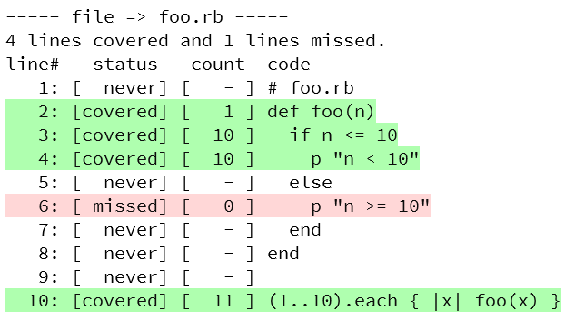

[](https://badge.fury.io/rb/simplecov_covview)

# Simplecov_covview

simplecov_covview is a coverage viewer for SimpleCov.

This formatter Generates a console report of your SimpleCov ruby code coverage results on Ruby.


## Installation

Add this line to your application's Gemfile:

```ruby
gem 'simplecov_covview'
```

And then execute:

    $ bundle install

Or install it yourself as:

    $ gem install simplecov_covview

## Usage

```ruby
require "simplecov"
require "simplecov_covview"

SimpleCov.formatter = SimpleCov::Formatter::CovView
# or
SimpleCov.formatter = SimpleCov::Formatter::MultiFormatter.new([
    SimpleCov::Formatter::HTMLFormatter,
    SimpleCov::Formatter::CovView
  ])
```

## Output options:

### 8-colors colorized output (default)
*  The default color mode is 8-colors mode.
*  To enable 8-colors, enable `use_8color` and disable `use_256color`.

```ruby
SimpleCov::Formatter::CovView.use_8color = true
SimpleCov::Formatter::CovView.use_256color = false
```


### 256-colors colorized output 
*  To enable 256-colors mode, enable `use_256color`.
* `use_256color` has priority over `use_8color`.
```ruby
SimpleCov::Formatter::CovView.use_8color = false
SimpleCov::Formatter::CovView.use_256color = true
# or
SimpleCov::Formatter::CovView.use_8color = true
SimpleCov::Formatter::CovView.use_256color = true
```


### No colorized output
Disabling 8-colors and 256-colors will result in no colorization.　　
```ruby
SimpleCov::Formatter::CovView.use_8color = false
SimpleCov::Formatter::CovView.use_256color = false
```


## Contributing

Bug reports and pull requests are welcome on GitHub at https://github.com/icm7216/simplecov_covview.

## License

The gem is available as open source under the terms of the [MIT License](https://opensource.org/licenses/MIT).
